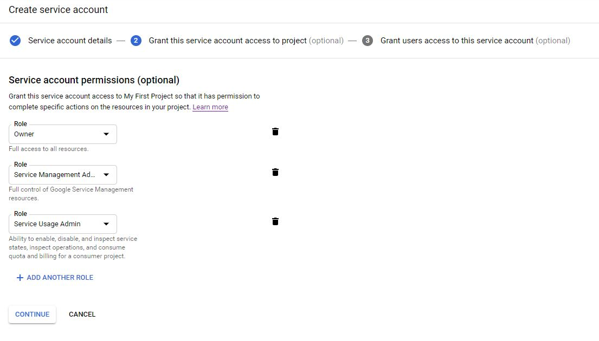
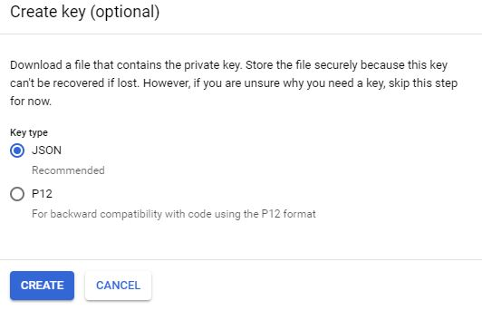

Tasks in the Role
=========


  - Install Google SDK and "gcloud" CLI tool. **MacOS and Debian/Redhat based distros support**
  - Deploy a K8s cluster using Google Kubernetes Services.
  - Activate RBAC into k8s Cluster


- Install Tiller server into k8s cluster 
- Install Helm client **MacOS and Debian/Redhat based distros support**


Requirements
------------

### GCP: 

1. Create a Service Account for access to your GCP Project: https://console.cloud.google.com/iam-admin/serviceaccounts/project?project=youproject


<p align="center">

</p>

***


2. Grant access to others accounts to use this Service Account. **Optional**


<p align="center">

</p>
<br/>
<br/>

***


3. The Following permissions has been assigned to Service Account. 
    - Owner
    - Service Management Administrator
    - Service Usage Admin


<p align="center">

</p>

***

- Download the key to the local path for deploy this playbook


<p align="center">

</p>

***


### To Run and Test PaaS demo

```bash
ansible-playbook site.yaml -i hosts  -e gcp_keyfile=/Path/to/key.json
```

---


## Note
- Platforms like a Azure or AWS to soon.
* Windows Environment to soon.


Author Information
------------------


__PaaS Knowledge Group__

## Members:
* Adrián González
* Jonis González


 